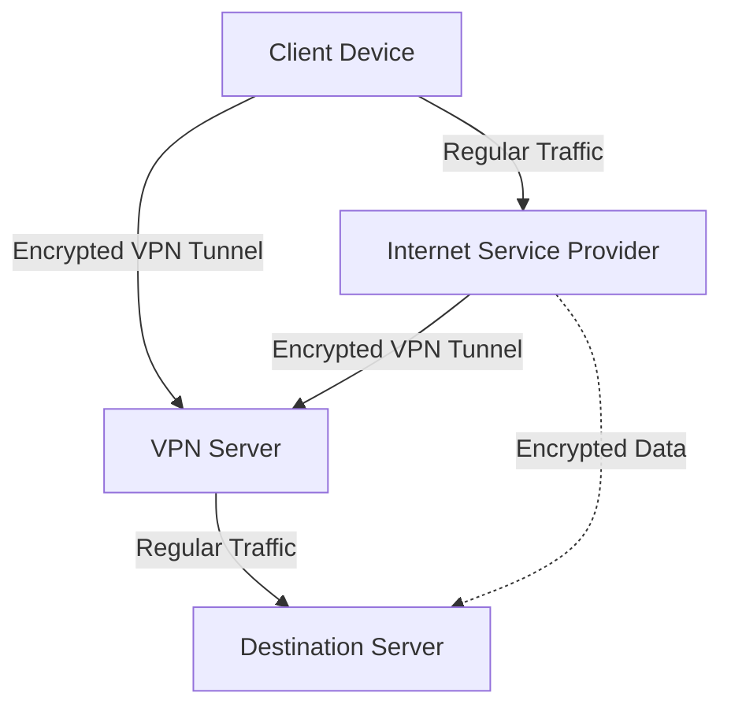

# فصل ۴

همانطور که در فصل دوم تصور کردیم که در حال بازی Minecraft هستید، این‌بار نیز همین روند را ادامه می‌دهیم. حالا که بازی را می‌شناسید، مختصات مکان‌ها را نوشته‌اید و چوب و یک میز کار در اختیار دارید، می‌توانید ابزارهایی مانند تبرهای چوبی، بیل، شمشیر، تخت و سرپناهی برای خواب در شب بسازید. شما می‌توانید موجودات (mobs) را بکشید، سنگ‌ها را جمع‌آوری کرده و معادن را کاوش کنید.

همانطور که پیشرفت می‌کنید، از ابزارهای سنگی به ابزارهای آهنی و در نهایت به ابزارهای الماسی می‌رسید. اگر این بازی را بازی کرده باشید، می‌دانید که رسیدن به سطح الماس نیازمند ماجراجویی‌های عمیق در غارهای ترسناک و زمان و شور و شوق زیاد است.

اما این فصل درباره اصول است—ابزارهای چوبی و سنگی دنیای حریم خصوصی. این‌ها حداقل‌ها و اصول اولیه‌ای هستند که پایه‌های حریم خصوصی و امنیت دیجیتال شما را تشکیل می‌دهند. البته اصول اولیه در دنیای حریم خصوصی متفاوت هستند: آن‌ها شامل ابزارهای رمزگذاری، ابزارهای ناشناس بودن، VPN ها، ایمیل‌های امن، پیام‌رسان‌های امن، ابزارهای مدیریت رمزعبور و ابزارهای احراز هویت چندعاملی هستند. این‌ها حداقل‌های حریم خصوصی هستند و با مدل تهدید اکثر افراد همخوانی دارند.

## رمزهای عبور و نرم‌افزارهای مدیریت رمز عبور

رمزهای عبور از حساب‌های کاربری، دستگاه‌ها و رازهای ما محافظت می‌کنند. ما باید تمام تلاش خود را برای ایمن نگه داشتن آن‌ها و دسترسی فقط خودمان به آن‌ها انجام دهیم. تلاش برای حفظ یک رمز عبور پیچیده ایده بدی است، و من قبلاً توضیح داده‌ام چرا. اگر از یک رمز عبور برای همه چیز استفاده کنید، بدون توجه به پیچیدگی آن، اگر یک نقض داده شامل حساب کاربری شما رخ دهد، تمام حساب‌های دیگر شما با استفاده از آن رمز عبور فاش شده در دسترس خواهند بود. و اگر سعی کنید برای هر وبسایت رمز عبور متفاوتی به خاطر بسپارید، احتمالاً همه آن‌ها را فراموش خواهید کرد. انسان‌ها در به خاطر سپردن رمزهای عبور تصادفی خیلی خوب نیستند، به‌ویژه اگر آن‌ها را زیاد به یاد نیاورند.

اینجا است که نرم افزارهای مدیریت رمزعبور وارد عمل می‌شوند. ابزارهای مدیریت رمزعبور نرم‌افزارهایی هستند، چه آنلاین یا آفلاین، که برای ذخیره رمزهای عبور و دیگر یادداشت‌ها و رازها به‌طور امن و با استفاده از رمزگذاری طراحی شده‌اند. محتوای داخل آن‌ها با یک رمز عبور قابل دسترسی است که معمولاً به عنوان رمز عبور اصلی شناخته می‌شود. هنگامی که از یک مدیر رمز عبور استفاده می‌کنید، یک رمز عبور پیچیده به عنوان رمز عبور اصلی خود به خاطر می‌سپارید که برای دسترسی به سایر رمزهای عبور داخل خزانه ابزار مدیریت رمز عبور استفاده می‌شود. حالا نیازی نیست هیچ رمز عبور یا راز دیگری را به یاد داشته باشید.

یک ابزار مدیریت رمز عبور خوب باید این ویژگی‌ها را داشته باشد:

1. **رمزگذاری:** باید رمزگذاری شده باشد. هرگز از ابزار مدیریت رمز عبوری که مطمئن از رمزگذاری آن نیستید، استفاده نکنید.
2. **متن‌باز بودن:** باید متن‌باز باشد. در حالی که نرم‌افزارهای متن‌باز لزوماً ایمن‌تر نیستند، متن‌باز بودن به ما اجازه می‌دهد تا کد آن‌ها و پیاده‌سازی رمزگذاری را بررسی کنیم تا مطمئن شویم ایمن هستند.
3. **بررسی‌های مستقل:** باید به‌طور مستقل بررسی شده باشند. ما کارشناسان تحلیل رمزنگاری نیستیم، بنابراین یک بررسی مشخص می‌کند که آیا در پیاده‌سازی رمزنگاری نرم‌افزار نقصی وجود دارد یا خیر.
4. **آفلاین یا خود-میزبانی:** بهتر است آفلاین یا خود-میزبانی باشد. استفاده از یک ابزار مدیریت رمز عبور مبتنی بر کلاد اگر به‌درستی پیاده‌سازی شده باشد مشکلی ندارد. حتی اگر پایگاه داده آن‌ها فاش شود، رمزهای عبور همچنان باید رمزگذاری شده و ایمن باشند. با این حال، استفاده از مدیر رمز عبور خود-میزبانی یا آفلاین، مانند Bitwarden (که می‌توان آن را خود-میزبانی کرد) یا KeePass، ریسک فاش شدن را به حداقل می‌رساند، زیرا احتمال اینکه شما بیشتر از سرور یک ابزار مدیریت رمز عبور با هزاران کاربر هدف قرار بگیرید، بسیار کمتر است.

### انتخاب یک رمز عبور اصلی امن

اما چگونه می‌توانید یک رمز عبور اصلی امن تولید کنید؟ باید ایده رمزهای عبور به‌عنوان رشته‌های تصادفی از حروف، اعداد و علائم نگارشی را فراموش کنید. آن‌ها برای انسان‌ها بسیار سخت به خاطر سپرده می‌شوند، اما برای رایانه‌ها به اندازه‌ای که فکر می‌کنید سخت نیستند تا از طریق حملات brute-force شکسته شوند. از طرف دیگر، عبارت‌های عبور—فهرست‌هایی از کلمات که با یک کاراکتر جدا شده‌اند—برای انسان‌ها به‌راحتی به خاطر سپرده می‌شوند، اما برای رایانه‌ها بسیار سخت‌تر است که آن‌ها را بشکنند، زیرا معمولاً طولانی‌تر هستند و از پیچیدگی بیشتری نسبت به یک رمز عبور معمولی برخوردارند. آن‌ها برای انسان‌ها به دلیل کلمات و معانی‌شان قابل به‌خاطر سپردن هستند، اگرچه برای رایانه‌ها کلمات همچنان به‌صورت رشته‌های تصادفی ظاهر می‌شوند.

این عبارت‌های عبور به عنوان **عبارت‌های Diceware** شناخته می‌شوند. یک مثال از عبارت Diceware به این شکل است:  
**Batboy Wielder Defective Squire Facial Reptilian Monologue Avatar**

## حفاظت از رمزهای عبور اصلی

تغییر بیش از حد رمزهای عبور اصلی توصیه نمی‌شود، مگر اینکه مشکوک باشید که رمز عبور شما لو رفته است، زیرا این کار می‌تواند ریسک فراموشی آن را افزایش دهد. همچنین، یک روش خوب این است که یک پشتیبان رمزگذاری‌شده از رمزهای عبور خود را در مکانی امن، ترجیحاً خارج از دستگاه‌های خود و با یک رمز عبور متفاوت (در صورت فراموشی رمز اصلی) ذخیره کنید تا در صورت نیاز به بازیابی رمزهای عبور، خطر از دست دادن دسترسی به حساب‌هایتان به حداقل برسد.

## امنیت ایمیل
خدمات ایمیل ذاتاً امن نیستند؛ فناوری‌های جدید معمولاً قبل از امنیت ظهور می‌کنند، و این در مورد ایمیل و اولین پروتکل‌های اینترنت نیز صادق است. اما این کمبود امنیت را می‌توان تا حدی با افزودن لایه‌های رمزگذاری به خدمات ایمیل جبران کرد.

### لایه‌های رمزگذاری برای امنیت ایمیل
اولین لایه رمزگذاری به کانال ارتباطی اضافه می‌شود. منظور از "کانال ارتباطی" کانالی است که داده‌ها از طریق آن به مقصد خود می‌رسند، نه محتوای ایمیل. این کار با افزودن TLS به لایه انتقال پروتکل ایمیل انجام می‌شود. امروزه اکثر ارائه‌دهندگان خدمات ایمیل به‌طور پیش‌فرض TLS را فعال کرده‌اند، اما اگر سرویس ایمیل خود را میزبانی می‌کنید، باید اطمینان حاصل کنید که رمزگذاری لایه انتقال فعال است.

دومین لایه رمزگذاری برای محتوای ایمیل است. این کار می‌تواند با استفاده از رمزگذاری PGP یا S/MIME انجام شود، اما برای ارسال ایمیل رمزگذاری‌شده باید کلید عمومی گیرنده را داشته باشید. ارائه‌دهندگان ایمیل رمزگذاری‌شده و متمرکز بر حریم خصوصی مانند ProtonMail و Tutanota می‌توانند این نیاز به داشتن کلید عمومی را از بین ببرند، به‌شرطی که هم فرستنده و هم گیرنده از همان ارائه‌دهنده ایمیل استفاده کنند. به‌عنوان مثال، دو کاربر ProtonMail می‌توانند بدون نیاز به دانستن کلید عمومی یکدیگر، ایمیل‌های رمزگذاری‌شده ارسال کنند.

حتی اگر محتوای ایمیل را رمزگذاری کنید، متاداده‌های آن همچنان رمزگذاری‌نشده باقی می‌مانند. این متاداده‌ها می‌توانند شامل موارد زیر باشند:

1. **آدرس ایمیل فرستنده:** آدرس ایمیل شخصی که ایمیل را ارسال کرده است.
2. **آدرس ایمیل گیرنده(ها):** آدرس ایمیل گیرنده(ها) ایمیل.
3. **زمان‌سنجی‌ها:** تاریخ و زمان ارسال و گاهی اوقات زمان دریافت ایمیل.
4. **خط موضوع:** خط موضوع ایمیل که خلاصه‌ای از محتوای آن است.
5. **شناسه پیام:** شناسه منحصربه‌فردی برای پیام ایمیل.
6. **مسیر بازگشت:** آدرس ایمیل که ایمیل‌های بازگشتی به آن ارسال می‌شوند.
7. **دریافت‌شده:** اطلاعات مربوط به سرورهای ایمیل و شبکه‌هایی که ایمیل در حین انتقال از آن‌ها عبور کرده است.
8. **X-Mailer:** یک فیلد اختیاری که نشان می‌دهد ایمیل با چه نرم‌افزاری نوشته شده است.
9. **نسخه MIME:** نسخه‌ای از پروتکل MIME که در ایمیل استفاده شده است.
10. **نوع محتوا:** نوع و فرمت محتوای پیام، مانند متن ساده یا HTML.

## امنیت پیام‌رسانی

بیشتر پیام‌های چت نیز امن نیستند. به‌عنوان مثال، تلگرام که به‌عنوان یک اپلیکیشن پیام‌رسان رمزگذاری‌شده و امن شناخته می‌شود، به‌طور پیش‌فرض رمزگذاری انتها به انتها (E2EE) ندارد. حتی زمانی که این امکان را ارائه می‌دهد، فقط در کلاینت‌های موبایل فعال است و شما نمی‌توانید از تلگرام به‌صورت ایمن در کلاینت دسکتاپ استفاده کنید. علاوه بر این، تلگرام اولین و مهم‌ترین قانون رمزنگاری را نقض می‌کند: "رمزنگاری خود را نسازید." تلگرام از یک طرح رمزنگاری خودساخته برای چت‌های E2EE خود استفاده می‌کند که باعث می‌شود امنیت آن زیر سؤال برود. همچنین، سرورهای تلگرام متن‌باز نیستند؛ هیچ‌کس نمی‌داند پیام‌ها و داده‌ها روی تلگرام چگونه ذخیره می‌شوند، آیا رمزگذاری شده‌اند یا چه کسی به این سرورها دسترسی دارد. تلگرام در نظر من مثال خوبی از یک پیام‌رسان ضعیف است. در حالی که پیام‌رسان‌هایی بدتر از تلگرام نیز وجود دارند، آن‌ها ادعای حریم خصوصی و امنیت نمی‌کنند. بنابراین، من تلگرام را به‌عنوان یک مثال بد استفاده می‌کنم تا توضیح دهم که یک اپلیکیشن پیام‌رسان امن باید چه ویژگی‌هایی داشته باشد.

### ویژگی‌های یک پیام‌رسان امن
- **رمزگذاری انتها به انتها:** یک پیام‌رسان امن باید E2EE را با یک طرح رمزنگاری شناخته‌شده و بررسی‌شده ارائه دهد. تلگرام تا حدودی این ویژگی را دارد، اما رمزنگاری آن قابل اعتماد نیست.
- **ثبت‌نام ناشناس:** یک پیام‌رسان خصوصی باید به شما اجازه دهد به‌طور ناشناس ثبت‌نام کنید، معمولاً با استفاده از یک ایمیل. تلگرام و سیگنال از شماره تلفن استفاده می‌کنند که برای کاهش هرزنامه منطقی است، اما روش‌هایی برای دور زدن آن وجود دارد، مانند خرید یک شماره VoIP ناشناس با استفاده از Monero یا پول نقد.
- **شفافیت:** یک پیام‌رسان امن باید شفاف باشد که داده‌ها چگونه ذخیره می‌شوند، چه داده‌هایی ذخیره می‌شوند و در چه شرایطی ممکن است داده‌ها به مقامات تحویل داده شوند.
- **جمع‌آوری متاداده:** هر پیام و حسابی دارای متاداده است که معمولاً رمزگذاری نمی‌شود. تلگرام مقدار زیادی متاداده درباره شما جمع‌آوری می‌کند، از جمله نام، تاریخ ثبت‌نام، آدرس‌های IP، ایمیل 2FA، شماره تلفن، مخاطبین، افرادی که با آن‌ها به‌طور مکرر صحبت می‌کنید و تمام پیام‌های شما (اگر از E2EE استفاده نکنید). آن‌ها می‌توانند این داده‌ها را در صورت لزوم به مقامات تحویل دهند. در مقابل، سیگنال اطلاعات کمی درباره شما جمع‌آوری می‌کند و حتی اگر با حکم دادگاه مجبور به تحویل داده‌ها شود، چیزی برای تحویل دادن ندارد.
- **محبوبیت:** ما نمی‌توانیم همه را مجبور کنیم از یک اپلیکیشن استفاده کنند. اگر همه کسانی که می‌شناسم از تلگرام استفاده می‌کنند، من هم مجبورم از تلگرام استفاده کنم. این یک عامل مهم برای یک پیام‌رسان است. ممکن است من به‌جای سیگنال از Matrix استفاده کنم، علی‌رغم اینکه سیگنال امنیت بهتری دارد و متاداده کمتری جمع‌آوری می‌کند، زیرا اکثر افرادی که با آن‌ها صحبت می‌کنم از Matrix استفاده می‌کنند و مجبور به انجام برخی فداکاری‌ها هستم.

مدل تهدید شما در اینجا نقش بزرگی دارد. ممکن است برای شما مهم نباشد که تلگرام یا هر شرکت دیگری پیام‌های شما را با دوستانتان بخواند. این بستگی به شما و مدل تهدیدتان دارد.

## انتخاب یک VPN امن

به‌طور معمول، هنگامی که از اینترنت استفاده می‌کنید، ISP شما می‌تواند به‌صورت فنی تمام داده‌هایی را که از طریق شبکه عبور می‌کند، ببیند. با این حال، با توجه به اینکه اکثر وبسایت‌ها و سرویس‌ها از رمزگذاری TLS/SSL پشتیبانی می‌کنند، ISP شما نمی‌تواند بیشتر داده‌ها را ببیند، اما همچنان می‌تواند آدرس IP و نام دامنه‌ای که درخواست می‌کنید را تشخیص دهد. هر چیزی که ISP شما می‌تواند ببیند، ارائه‌دهنده VPN شما نیز می‌تواند ببیند. به همین دلیل، استفاده از VPN به‌طور عمده به معنای تغییر محل اعتماد است. به‌عنوان مثال، ISP من اطلاعات زیادی را لاگ می‌کند که ترجیح می‌دهم لاگ نشود و این اطلاعات را برای مدت طولانی نگه می‌دارد. با این حال، ارائه‌دهنده VPN من (ProtonVPN و Mullvad) قول می‌دهد که هیچ چیزی لاگ نکند. آن‌ها VPN های معتبری هستند که بر حریم خصوصی تمرکز دارند و اجازه پرداخت ناشناس می‌دهند، به‌ویژه Mullvad VPN. در این سناریو، من ترجیح می‌دهم همیشه از VPN استفاده کنم، زیرا بیشتر از ISP به آن اعتماد دارم.

گاهی اوقات، استفاده از VPN به‌منظور دور زدن سانسور است. VPN ها برای این منظور عالی هستند، زیرا داده‌های عبوری از شبکه را رمزگذاری می‌کنند و سیستم‌های سانسور را در تشخیص آن‌ها دچار مشکل می‌کنند. اما حتی در این حالت نیز، موضوع تغییر محل اعتماد است و VPN باید داده‌های کمی درباره ما و فعالیت‌های ما جمع‌آوری کند.

برای من، یک ارائه‌دهنده VPN باید ویژگی‌های زیر را داشته باشد:

- **رمزگذاری قوی:** باید از روش‌ها و پروتکل‌های رمزگذاری امن، مانند WireGuard و OpenVPN، استفاده کند و روشی برای رمزگذاری داشته باشد که از **Perfect Forward Secrecy** پشتیبانی کند. Perfect Forward Secrecy تضمین می‌کند که حتی اگر کلید اصلی به خطر بیفتد، داده‌های رمزگذاری‌شده قابل دسترسی نباشند.
- **سیاست عدم نگهداری لاگ‌ها:** یک ارائه‌دهنده VPN خصوصی نباید لاگ‌های فعالیت‌های کاربر، اتصالات، زمان‌سنجی‌ها یا آدرس‌های IP را نگهداری کند. به‌عنوان مثال، ارائه‌دهندگانی مانند Mullvad، ProtonVPN و Windscribe اطلاعات زیادی درباره ترافیک شما جمع‌آوری نمی‌کنند.
- **محافظت در برابر نشت DNS:** یک VPN امن و خصوصی باید اطمینان حاصل کند که درخواست‌های DNS از طریق تونل VPN ارسال می‌شوند، نه از طریق ISP کاربر. این کار از نشت اطلاعات مربوط به وبسایت‌های بازدیدشده به ISP جلوگیری می‌کند.
- **قطع‌کن (Kill Switch):** یک VPN خصوصی باید ویژگی‌ای داشته باشد که در صورت قطع اتصال VPN، کاربر را از اینترنت جدا کند تا اطمینان حاصل شود که هیچ داده‌ای از طریق یک اتصال رمزگذاری‌نشده ارسال نمی‌شود.
- **پنهان‌سازی آدرس IP:** VPN باید آدرس IP واقعی کاربر را با یکی از آدرس‌های IP سرورهای VPN جایگزین کند.
- **مسیر چندگانه (Multi-Hop):** یک ویژگی مفید برای VPN این است که ترافیک کاربر از طریق چندین سرور در مکان‌های مختلف عبور کند و یک لایه اضافی از امنیت و حریم خصوصی ایجاد کند.
- **احراز هویت امن:** یک ارائه‌دهنده VPN ایده‌آل باید سیستم‌های احراز هویت چندعاملی (مانند TOTP یا حتی کدهای احراز هویت از طریق پیامک/ایمیل) داشته باشد تا از حساب‌های کاربری محافظت کند.
- **سرورهای خصوصی:** باید از سرورهای خصوصی یا اختصاصی به‌جای سرورهای مشترک استفاده کند تا خطر رهگیری داده‌ها کاهش یابد.
- **پنهان‌سازی (Obfuscation):** باید ویژگی‌های پنهان‌سازی برای دور زدن سیستم‌های سانسور مانند **Deep Packet Inspection** (DPI) داشته باشد که ترافیک VPN را به شکل ترافیک عادی درآورد، معمولاً با استفاده از پروتکل پنهان‌سازی مانند obfs4 یا ScrambleSuit.
- **حوزه قضایی:** بهتر است که در کشوری با قوانین قوی حفظ حریم خصوصی مستقر باشد و خارج از نفوذ ائتلاف‌های نظارتی مانند Five Eyes، Nine Eyes یا Fourteen Eyes باشد.
- **بررسی‌های منظم:** باید بررسی‌های امنیتی منظم توسط اشخاص ثالث مستقل داشته باشد تا سیاست عدم نگهداری لاگ‌ها و امنیت کلی سرویس تأیید شود.

این ویژگی‌ها بسته به مدل تهدید کاربر متفاوت است. همه افراد به ویژگی‌هایی مانند مسیر چندگانه یا سیاست‌های عدم نگهداری لاگ‌ها اهمیت نمی‌دهند. همیشه باید بر اساس مدل تهدید خود عمل کنید.

## امنیت/حریم خصوصی سیستم‌عامل‌ها

سیستم‌عامل‌ها نرم‌افزاری هستند که با سخت‌افزار ارتباط برقرار می‌کنند و منابع سخت‌افزاری مانند تخصیص حافظه، زمان‌بندی وظایف، فرآیندهای I/O و موارد دیگر را مدیریت می‌کنند. در حالی که این‌ها از عملکردهای اصلی یک سیستم‌عامل (یا هسته آن) هستند، لایه‌های نرم‌افزار روی هسته انباشته می‌شوند تا یک سیستم‌عامل قابل استفاده ایجاد کنند، که می‌تواند تأثیر زیادی بر حریم خصوصی و امنیت کاربران داشته باشد.

### اندروید

**پروژه متن‌باز اندروید (AOSP)** یک سیستم‌عامل مناسب و امن است که بوت‌های تأییدشده، محافظت از اپلیکیشن‌ها (یک ویژگی امنیتی مهم) و سیستم مدیریت مجوز قوی دارد.

با این حال، زمانی که یک گوشی اندرویدی می‌خرید، سیستم‌عامل آن معمولاً نسخه اصلی اندروید نیست. اغلب با بسیاری از اپلیکیشن‌ها و ویژگی‌های اضافی که عمدتاً برای جمع‌آوری داده‌ها از فعالیت‌های کاربران طراحی شده‌اند، تغییر داده می‌شود.

برای رفع این مشکل، ROMهای سفارشی طراحی شده‌اند. حتی بدون ROMهای سفارشی، بسیاری از ویژگی‌های غیرضروری را می‌توان غیرفعال کرد تا جمع‌آوری داده‌ها به حداقل برسد.

نکته مهم‌تر از جمع‌آوری داده‌ها این است که اطمینان حاصل کنید گوشی با آخرین پچ‌های امنیتی به‌روزرسانی شده و از روت کردن خودداری کنید (زیرا می‌تواند محافظت اپلیکیشن را از بین ببرد و امنیت گوشی را به خطر بیندازد).

روی برخی از گوشی‌ها، مانند Google Pixel، می‌توانید **GrapheneOS** نصب کنید، که یک ROM سفارشی اندرویدی بسیار امن و محترم به حریم خصوصی است.

### iOS

برخلاف اندروید، iOS متن‌باز نیست، بنابراین نمی‌توانیم مطمئن باشیم که به‌صورت داخلی چگونه کار می‌کند، و اگر یک آیفون دارید، کار زیادی نمی‌توانید برای تغییر آن انجام دهید. با این حال، می‌توانید تنظیمات را تغییر داده و ویژگی‌های غیرضروری را برای رفع نیازهای خود غیرفعال کنید.

### ویندوز

مایکروسافت ویندوز یکی از رایج‌ترین سیستم‌عامل‌های رایانه‌های شخصی است، اما امنیت و حریم خصوصی آن قابل تحسین نیست. مقدار زیادی داده‌های telemetry به مایکروسافت ارسال می‌کند و متن‌باز نیست، که رفع باگ‌های امنیتی را سخت‌تر می‌کند و تعداد زیادی آسیب‌پذیری روز صفر برای ویندوز وجود دارد.

شاید تنظیماتی برای تغییر و تنظیم وجود داشته باشد، اما گزینه امن‌تر این است که یک توزیع لینوکس نصب کنید و در صورت نیاز مطلق به داشتن یک دستگاه ویندوزی، از ویندوز در یک ماشین مجازی ایزوله استفاده کنید.

### لینوکس

لینوکس یک سیستم‌عامل رایگان و متن‌باز با ویژگی‌های عالی حفظ حریم خصوصی است. از آنجا که متن‌باز است و مدت‌هاست که وجود دارد، تعداد کمی از آسیب‌پذیری‌های روز صفر برای آن وجود دارد.

لینوکس هزاران توزیع برای انتخاب دارد، که آن را برای هر نیازی که ممکن است داشته باشید، مناسب می‌کند. همچنین انواع مختلفی از هسته لینوکس، مانند **linux-hardened**، وجود دارند که برای داشتن ویژگی‌های امنیتی بیشتر به‌طور پیش‌فرض طراحی شده‌اند.

---

این‌ها حداقل‌های حریم خصوصی و امنیت بودند. با پیشرفت کتاب، فصل‌ها بیشتر فنی خواهند شد و تمرکز بیشتری بر ناشناس بودن خواهند داشت. فصل بعدی درباره رمزگذاری خواهد بود، زیرا این اساس امنیت در دنیای آنلاین است.